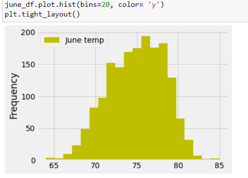

# surfs_up
we will use jupyter notebook for module 9
# Overview of the analysis: 
    The intial analysis that we did for W.Avy's surf shop was liked by him, so he requested for more information about temprature trends before opening the surf shop. He was interested in temprature data especially for month of June and December in Oahu. This would help him to determine if the surf and ice cream shop buisness is sustainable the whole year or not.

 # Results: 
    1. Summary statistics from June reveled that mean temperature at Oahu was around 74degrees 

    with minimun of 64 and maximum of 85 degrees fahrenheit which was favourable for what Avy was looking for, as seen in the figure

    2. After analysis for december showed the temperatures were slightly lower than june but still warmer, suggesting that it is good for surf's shop.

    As seen in the figures above
    3. All the above anaysis helps one to plan how to stock their shop and with what items.
 # Summary:
     Two additional queries: 
     . one looking at june and dec statistics side by side were helpful.
     . Second histogram of june and dec temprature futher were also helpful in understanding the numbers, and gave us more clearer picture.

     . Another query on stations gives us additional help in understanding stations and their respective tempratures.

